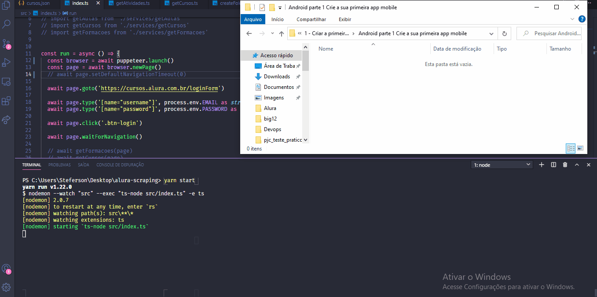
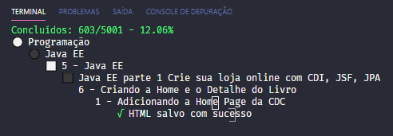
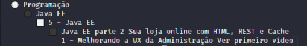

# Leads - Frontend

Projeto experimental em Node JS que realiza o download de páginas e vídeos de cursos da Alura.

<p align="center">
  
</p>

<h4 align="center">
  <a href="#started" >
    Instalação
  </a>
  |
  <a href="#how-to-use" >
    Como Usar
  </a>
  |
  <a href="#folders" >
    Estrutura de Pastas
  </a>
  |
  <a href="#license" >
    Licença
  </a>
</h4>

<h2 name="started">▶ Instalação</h2>

Baixe ou clone o projeto do Github

```bash
git clone https://github.com/steferson-augusto/alura-scraping.git
```

Abra o diretório do projeto e execute `npm install` ou `yarn`.

Crie um arquivo ```.env``` na raiz do projeto com os valores correspondentes a seguinte estrutura:
```
  EMAIL=exemplo@email.com
  PASSWORD=suasenha123
```

<br/>
<h2 name="how-to-use">🐱‍👤 Como Usar</h2>

Na raiz do projeto, execute ```npm run extract``` ou ```yarn extract```.

Observe que haverá um log descrevendo o status da operação.

<p align="center">
  
</p>

A imagem acima possui o seguinte status de conclusão:
```"Concluídos: 603/5001 - 12.06%"```

De maneira "5001" representa a quantidade total de atividades na plataforma e "603" representa a quantidade já baixada.

Isto posto, o comando ```npm run extract``` ou ```yarn extract``` aceita um parâmetro ```--start``` de inicialização para situações em que seja preciso pausar a aplicação e começar em um determinado ponto. Exemplo:

```yarn extract --start 603```

Assim, o bot iniciará o download a partir da atividade 603.

<br/>
<h2 name="folders">📁 Estrutura de Pastas</h2>

Todos os arquivos são baixados na pasta ```data``` adotando a seguinte estrutura:

- data
  - categoria (mobile, devOps e etc)
    - formação (Android, Flutter e etc)
      - curso (Fundamentos de Flutter, Persistência de dados e etc)
        - aula (Primeiros passos, implementando layout com Widgets e etc)
          - atividade (introdução, preparando o ambiente e etc)
            - arquivo html ou vídeo

<p align="center">
  
</p>

<br/>
<h2 name="license">📝 Licença</h2>
<p>Este projeto está sob uma licença MIT. Veja mais informações em <a href="https://github.com/steferson-augusto/alura-scraping/blob/master/LICENSE" target="_blank">LICENSE</a>.</p>

---

<p>Criado por <a href="https://www.linkedin.com/in/st%C3%A9ferson-augusto-4b0b9b124/" target="_blank">Stéferson Augusto</a></p>
